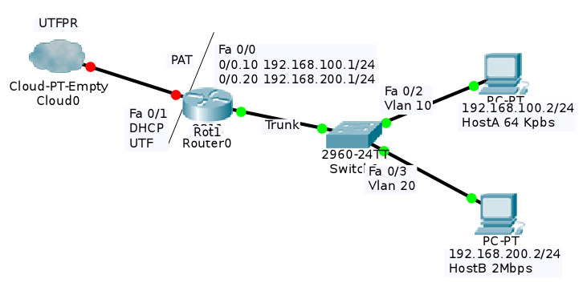

# QoS

## Configuração de uma rede VoIP

Vamos configurar uma rede com a seguinte topologia:


### Configuração do Switch

```ios
Switch(config)#interface range fa0/1 – 5
Switch(config-if-range)#switchport mode access
Switch(config-if-range)#switchport voice vlan 1
```

### Configuração do roteador 2811 com o CME:

```ios
Router(config)#int fa 0/0
Router(config-if)#ip add 192.168.10.1 255.255.255.0
Router(config-if)#no shutdown
Router(config-if)#exit
Router(config)#ip dhcp pool voicelab
Router(dhcp-config)#network 192.168.10.0 255.255.255.0
Router(dhcp-config)#default-router 192.168.10.1
Router(dhcp-config)#option 150 ip 192.168.10.1
Router(dhcp-config)#exit
Router(config)#telephony-service
Router(config-telephony)#max-dn 5
Router(config-telephony)#max-ephones 5
Router(config-telephony)#ip source-address 192.168.10.1 port 2000
Router(config-telephony)#auto assign 1 to 5
Router(config-telephony)#exit
Router(config)#ephone-dn 1
Router(config-ephone-dn)#number 54001
Router(config-ephone-dn)#exit
Router(config)#ephone-dn 2
Router(config-ephone-dn)#number 54002
Router(config-ephone-dn)#
Router(config)#ephone-dn 3
Router(config-ephone-dn)#number 11111
```

### Configuração da Qualidade de Serviço (QoS) no Switch 2960


```ios
Switch#configure terminal
Switch(config)#mls qos
Switch(config)#interface range fastEthernet 0/1-5
Switch(config-if-range)#mls qos
Switch(config-if-range)#mls qos cos 5
Switch(config-if-range)#mls qos trust cos
Switch(config-if-range)#exit
Switch(config)#interface range fastEthernet 0/10-22
Switch(config-if-range)#mls qos
Switch(config-if-range)#mls qos cos 0
Switch(config-if-range)#mls qos trust cos
Switch(config-if-range)#exit
Switch(config)#end
Switch#wr
```

# Policing 

## Topologia



## Básico

```ios
Rot1(config)#interface fa 0/1
Rot1(config-if)#ip address dhcp
Rot1(config-if)#description Link para UTFPR
Rot1(config-if)#ip nat outside
Rot1(config-if)#no shutdown
Rot1(config-if)#exit
Rot1(config)#interface fa 0/0
Rot1(config-if)#no shutdown
Rot1(config-if)#exit
Rot1(config)#interface fa 0/0.10
Rot1(config-if)#encapsulation dot1q 10
Rot1(config-if)#ip address 192.168.100.1 255.255.255.0
Rot1(config-if)#ip nat inside
Rot1(config-if)#exit
Rot1(config)#interface fa 0/0.20
Rot1(config-if)#encapsulation dot1q 20
Rot1(config-if)#ip address 192.168.200.1 255.255.255.0
Rot1(config-if)#ip nat inside
Rot1(config-if)#exit
Rot1(config)#ip route 0.0.0.0 0.0.0.0 10.15.2.254
Rot1(config)#access-list 1 permit 192.168.0.0 0.0.255.255
Rot1(config)#ip nat inside source list 1 interface fa 0/1 overload
```

## Configuração Policing

```ios
Rot1(config)#ip access-list extended HostA
Rot1(config-ext-nacl)#permit ip any host 192.168.100.2
Rot1(config-ext-nacl)#permit ip host 192.168.100.2 any
Rot1(config-ext-nacl)#exit
Rot1(config)#class-map match-all HA
Rot1(config-cmap)#match access-group name HostA
Rot1(config-cmap)#exit
Rot1(config)#policy-map QoS1
Rot1(config-pmap)#class HA
* Rot1(config-pmap-c)#police rate 64000 bps
Rot1(config-pmap-c-police)#end
Rot1#config terminal
Rot1(config)#interface fa 0/0.10
Rot1(config-if)#service-policy output QoS1
```

## *** Configuração Shapping

* Ao invés de police rate ... Na linha

```ios
Rot1(config-pmap-c)#police rate 64000 bps
```

* Colocar:

```ios
Rot1(config-pmap-c)#shape average 128000
```


## Continuação...
```ios
Rot1(config)#ip access-list extended HostB
Rot1(config-ext-nacl)#permit ip any host 192.168.200.2
Rot1(config-ext-nacl)#permit ip host 192.168.200.2 any
Rot1(config-ext-nacl)#exit
Rot1(config)#class-map match-all HB
Rot1(config-cmap)#match access-group name HostB
Rot1(config-cmap)#exit
Rot1(config)#policy-map QoS2
Rot1(config-pmap)#class HB
Rot1(config-pmap-c)#police rate 2000000 bps
Rot1(config-pmap-c-police)#end
Rot1#config terminal
Rot1(config)#interface fa 0/0.20
Rot1(config-if)#service-policy output QoS2
```
