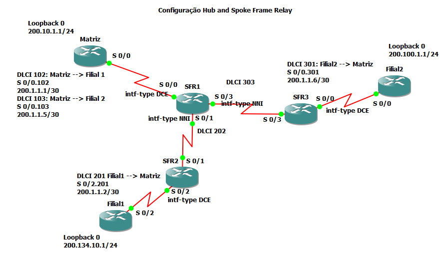

# PVC frame relay

## Configuração básica de um PVC Frame Relay PVC em um roteador com interface serial.


## Configuração de um mapa estático Frame Relay


# Configuração de uma topologia de rede Frame Relay Hub and Spoke



## Configuração do Roteador da Matriz
```ios
Router#config terminal
Router(config)#hostname Matriz
Matriz(config)#interface serial 0/0
Matriz(config-if)#encapsulation frame-relay
Matriz(config-if)#no frame-relay inverse-arp
Matriz(config-if)#no shut
Matriz(config-if)#exit
Matriz(config)#interface serial 0/0.102 point-to-point
Matriz(config-subif)#ip address 200.1.1.1 255.255.255.252
Matriz(config-subif)#frame-relay interface-dlci 102
Matriz(config-fr-dlci)#exit
Matriz(config-subif)#exit
Matriz(config)#interface serial 0/0.103 point-to-point
Matriz(config-subif)#ip address 200.1.1.5 255.255.255.252
Matriz(config-subif)#frame-relay interface-dlci 103
Matriz(config-fr-dlci)#exit
Matriz(config-subif)#exit
Matriz(config)#interface loopback 0
Matriz(config-if)#ip address 200.10.1.1 255.255.255.0
Matriz(config-if)#no shut
Matriz(config-if)#exit
Matriz(config)#
```

## Configuração do roteador da Filial 1
```ios
Router>enable
Router#config terminal
Router(config)#hostname Filial1
Filial1(config)#interface serial 0/2
Filial1(config-if)#encapsulation frame-relay
Filial1(config-if)#no frame-relay inverse-arp
Filial1(config-if)#no shutdown
Filial1(config-if)#exit
Filial1(config)#
Filial1(config)#interface serial 0/2.201 point-to-point
Filial1(config-subif)#
Filial1(config-subif)#ip address 200.1.1.2 255.255.255.252
Filial1(config-subif)#frame-relay interface-dlci 201
Filial1(config-fr-dlci)#exit
Filial1(config-subif)#exit
Filial1(config)#interface loopback 0
Filial1(config-if)#ip address 200.134.10.1 255.255.255.0
Filial1(config-if)#end
Filial1#
```

## Configuração do roteador da Filial 2

```ios
Router>enable
Router#config terminal
Router(config)#hostname Filial2
Filial2(config)#interface serial 0/0
Filial2(config-if)#encapsulation frame-relay
Filial2(config-if)#no frame-relay inverse-arp
Filial2(config-if)#no shut
Filial2(config-if)#clock rate 640
Filial2(config-if)#exit
Filial2(config)#interface serial 0
Filial2(config)#interface serial 0/0.301 point-to-point
Filial2(config-subif)#ip address 200.1.1.6 255.255.255.252
Filial2(config-subif)#frame-relay interface-dlci 301
Filial2(config-fr-dlci)#exit
Filial2(config-subif)#exit
Filial2(config)#interface loopback 0
Filial2(config-if)#ip address 200.100.1.1 2
Filial2(config-if)#ip address 200.100.1.1 255.255.255.0
Filial2(config-if)#no shut
Filial2(config-if)#end
Filial2#
```

## Configuração do Switch Frame Relay 1

```ios
SFR1#config terminal
SFR1(config)#hostname SFR1
SFR1(config)#frame-relay switching
SFR1(config)#interface serial 0/0
SFR1(config-if)#encapsulation frame-relay
SFR1(config-if)#no frame-relay inverse-arp
SFR1(config-if)#frame-relay intf-type dce
SFR1(config-if)#frame-relay route 102 interface serial 0/1 202
SFR1(config-if)#frame-relay route 103 interface serial 0/3 303
SFR1(config-if)#clock rate 64000
SFR1(config-if)#no shut
SFR1(config-if)#exit
SFR1(config)#interface serial 0/1
SFR1(config-if)#encapsulation frame-relay
SFR1(config-if)#no frame-relay inverse-arp
SFR1(config-if)#frame-relay intf-type nni
SFR1(config-if)#frame-relay route 202 interface serial 0/0 102
SFR1(config-if)#clock rate 64000
SFR1(config-if)#no shut
SFR1(config-if)#exit
SFR1(config)#interface serial 0/3
SFR1(config-if)#encapsulation frame-relay
SFR1(config-if)#no frame-relay inverse-arp
SFR1(config-if)#frame-relay intf-type nni
SFR1(config-if)#frame-relay route 303 interface serial 0/0 103
SFR1(config-if)#clock rate 64000
SFR1(config-if)#no shut
SFR1(config-if)#end
SFR1#
```

## Configuração do Switch Frame Relay 2

```ios
SFR2#config terminal
SFR2(config)#frame-relay switching
SFR2(config)#interface serial 0/1
SFR2(config-if)#encapsulation frame-relay
SFR2(config-if)#no frame-relay inverse-arp
SFR2(config-if)#clock rate 64000
SFR2(config-if)#frame-relay intf-type nni
SFR2(config-if)#frame-relay route 202 interface serial 0/2 201
SFR2(config-if)#no shut
SFR2(config-if)#exit
SFR2(config)#
SFR2(config)#interface serial 0/2
SFR2(config-if)#encapsulation frame-relay
SFR2(config-if)#no frame-relay inverse-arp
SFR2(config-if)#frame-relay intf-type dce
SFR2(config-if)#frame-relay route 201 interface serial 0/1 202
SFR2(config-if)#clock rate 64000
SFR2(config-if)#no shut
SFR2(config-if)#
SFR2(config-if)#end
SFR2#wr
```

## Configuração do Switch Frame Relay 3

```ios
SFR3#configure terminal
SFR3(config)#frame-relay switching
SFR3(config)#interface serial 0/3
SFR3(config-if)#encapsulation frame-relay
SFR3(config-if)#no frame-relay inverse-arp
SFR3(config-if)#clock rate 64000
SFR3(config-if)#frame-relay intf-type nni
SFR3(config-if)#frame-relay route 303 interface serial 0/0 301
SFR3(config-if)#no shut
SFR3(config-if)#exit
SFR3(config)#interface serial 0/0
SFR3(config-if)#encapsulation frame-relay
SFR3(config-if)#no frame-relay inverse-arp
SFR3(config-if)#frame-relay intf-type dce
SFR3(config-if)#clock rate 64000
SFR3(config-if)#frame-relay route 301 interface serial 0/3 303
SFR3(config-if)#no shutConfiguração do Roteador da Matriz
Router#config terminal
Router(config)#hostname Matriz
Matriz(config)#interface serial 0/0
Matriz(config-if)#encapsulation frame-relay
Matriz(config-if)#no frame-relay inverse-arp
Matriz(config-if)#no shut
Matriz(config-if)#exit
Matriz(config)#interface serial 0/0.102 point-to-point
Matriz(config-subif)#ip address 200.1.1.1 255.255.255.252
Matriz(config-subif)#frame-relay interface-dlci 102
Matriz(config-fr-dlci)#exit
Matriz(config-subif)#exit
SFR3(config-if)#end
SFR3#
```

## Configuração do protocolo de roteamento OSPF

```ios
Matriz
Matriz#config terminal
Matriz(config)#router ospf 1
Matriz(config-router)#network 200.10.1.0 0.0.0.255 area 0
Matriz(config-router)#network 200.1.1.0 0.0.0.3 area 0
Matriz(config-router)#network 200.1.1.4 0.0.0.3 area 0
Matriz(config-router)#end
```

## Filial 1

```ios
Filial1>enable
Filial1#config terminal
Filial1(config)#route ospf 1
Filial1(config)#router ospf 1
Filial1(config-router)#network 200.134.10.0 0.0.0.255 area 0
Filial1(config-router)#network 200.1.1.0 0.0.0.3 area 0
Filial1(config-router)#end
Filial1#
```

## Filial 2

```ios
Filial2>enable
Filial2#config terminal
Filial2(config)#router ospf 1
Filial2(config-router)#network 200.100.1.0 0.0.0.255
Filial2(config-router)#network 200.100.1.0 0.0.0.255 area 0
Filial2(config-router)#network 200.1.1.4 0.0.0.3 area 0
Filial2(config-router)#end
Filial2#
```

## Verificando as configurações:

```ios
Matriz#show frame-relay map
Serial0/0.102 (up): point-to-point dlci, dlci 102(0x66,0x1860), broadcast
          status defined, active
Serial0/0.103 (up): point-to-point dlci, dlci 103(0x67,0x1870), broadcast
          status defined, active
Matriz#

Matriz#show ip route
Codes: C - connected, S - static, R - RIP, M - mobile, B - BGP
       D - EIGRP, EX - EIGRP external, O - OSPF, IA - OSPF inter area
       N1 - OSPF NSSA external type 1, N2 - OSPF NSSA external type 2
       E1 - OSPF external type 1, E2 - OSPF external type 2
       i - IS-IS, su - IS-IS summary, L1 - IS-IS level-1, L2 - IS-IS level-2
       ia - IS-IS inter area, * - candidate default, U - per-user static route
       o - ODR, P - periodic downloaded static route

Gateway of last resort is not set

     200.1.1.0/30 is subnetted, 2 subnets
C       200.1.1.0 is directly connected, Serial0/0.102
C       200.1.1.4 is directly connected, Serial0/0.103
C    200.10.1.0/24 is directly connected, Loopback0
     200.100.1.0/32 is subnetted, 1 subnets
O       200.100.1.1 [110/65] via 200.1.1.6, 00:06:33, Serial0/0.103
     200.134.10.0/32 is subnetted, 1 subnets
O       200.134.10.1 [110/65] via 200.1.1.2, 00:06:33, Serial0/0.102

Matriz#show frame-relay pvc

PVC Statistics for interface Serial0/0 (Frame Relay DTE)

              Active     Inactive      Deleted       Static
  Local          2            0            0            0
  Switched       0            0            0            0
  Unused         0            0            0            0

DLCI = 102, DLCI USAGE = LOCAL, PVC STATUS = ACTIVE, INTERFACE = Serial0/0.102

  input pkts 119           output pkts 130          in bytes 19887
  out bytes 21642          dropped pkts 0           in pkts dropped 0
  out pkts dropped 0                out bytes dropped 0
  in FECN pkts 0           in BECN pkts 0           out FECN pkts 0
  out BECN pkts 0          in DE pkts 0             out DE pkts 0
  out bcast pkts 110       out bcast bytes 19562
  5 minute input rate 0 bits/sec, 0 packets/sec
  5 minute output rate 0 bits/sec, 0 packets/sec
  pvc create time 00:54:05, last time pvc status changed 00:39:42

DLCI = 103, DLCI USAGE = LOCAL, PVC STATUS = ACTIVE, INTERFACE = Serial0/0.103

  input pkts 101           output pkts 120          in bytes 16648
  out bytes 20555          dropped pkts 0           in pkts dropped 0
  out pkts dropped 0                out bytes dropped 0
  in FECN pkts 0           in BECN pkts 0           out FECN pkts 0
  out BECN pkts 0          in DE pkts 0             out DE pkts 0
  out bcast pkts 105       out bcast bytes 18995
  5 minute input rate 0 bits/sec, 0 packets/sec
  5 minute output rate 0 bits/sec, 0 packets/sec
  pvc create time 00:53:14, last time pvc status changed 00:11:46
Matriz#
```
